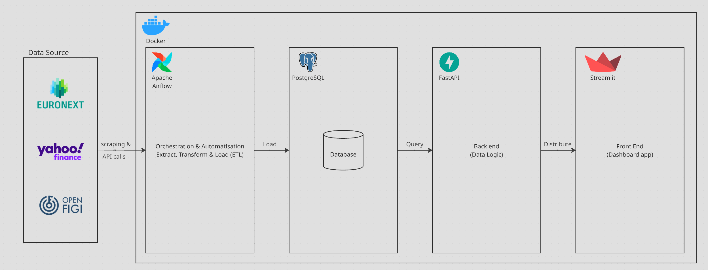

# CAC40 Stock Valuation

[Live Demo](https://streamlit.nathan-mg.com)

## Introduction

End-to-end Data Engineering pipeline that tracks and visualizes stock valuation ratios (P/E, P/S, Dividend Yield) for all 40 companies of the CAC40 index, updated daily.

👉 [View the live dashboard](https://streamlit.nathan-mg.com)

The subject of stock valuation was chosen because understanding how stocks are priced is genuinely useful — and comparing a stock's price against a company's fundamentals is the foundation of any serious analysis.

**Tech stack:** Docker Compose · Apache Airflow · PostgreSQL · FastAPI · Streamlit

Everything is open-source, designed to deliver an end-to-end data project at low cost.

## Features

- **Fully autonomous data pipeline** (updated every day)
  - List of companies included in the CAC40
  - Balance sheet and financials for all companies
  - Latest stock market price (day n-1)
  - Day-by-day ratio calculation (Price-to-Earnings, Price-to-Sales, Dividend Yield)
- **Dashboard**
  - Select one or more CAC40 companies, a period (1 month, 6 months, current year, 1 year, 5 years), and a ratio to compare
  - Explanation of each ratio used
  - Cards showing the latest stock valuation for selected companies and variation over the selected period
  - Line chart showing stock valuation evolution over the selected period
  - Line chart showing selected ratio evolution over the selected period
  - Bar chart ranking companies by their latest calculated ratio
  - Summary table showing all latest values for all selected companies

## Architecture



The pipeline runs daily via Airflow. CAC40 companies list is scrapped from the Euronext website, Raw financial (stock prices, balance sheet & financials) data is fetched from an external API, stored in PostgreSQL, served through a FastAPI layer, and visualized in Streamlit. Everything runs in Docker Compose.

FastAPI acts as a security layer between Streamlit and the database — credentials are never exposed to the frontend. It also makes the data reusable by any other client (mobile app, third-party integration, etc.) without touching the database layer.

## Run locally

```bash
git clone https://github.com/MAREYGUIDINathan/CAC40-stock-valuation.git
cd cac40-stock-valuation
```

rename ".env.exemple" to ".env" then change credentials

```bash
docker compose up
```

once every container is up got to http://127.0.0.1:8080/ and connect with username airflow and the credentials you put in the .env  
after that go to dag and launch cac40_valuation  
then you can visit the dashboard (http://127.0.0.1:8501/)

## Known issues

- ArcelorMittal data not showing due to an issue with the API used — needs either an exception handler or a pipeline fix

---

